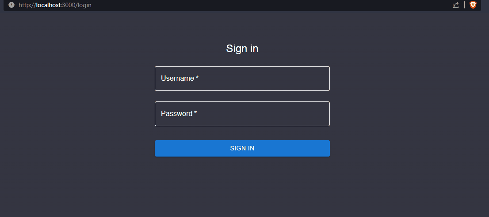
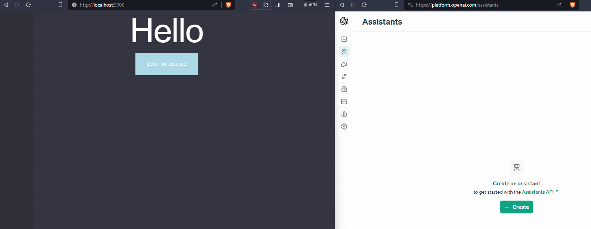
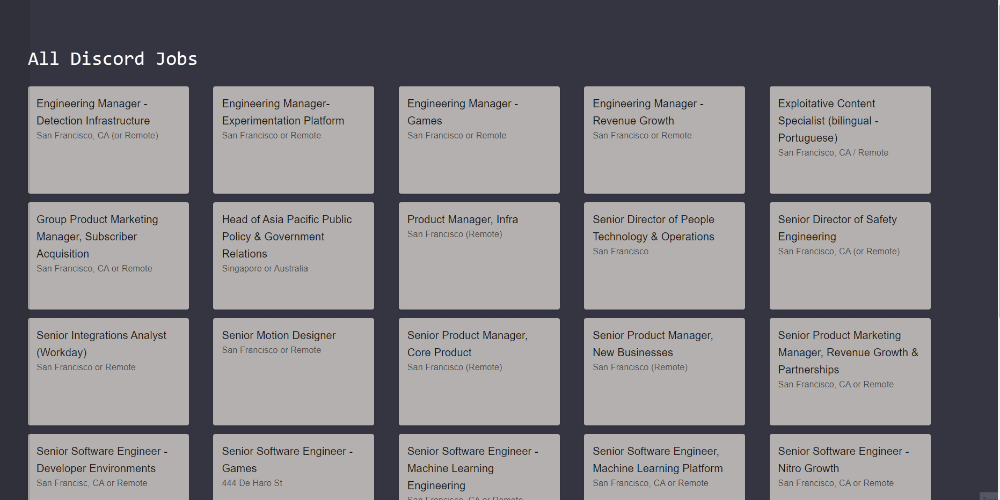

## Job Helper

### a web app that 
   - Send the your resume and job descrption to open ai chatgpt and ask it to rate how fit are you for the job out of 10

### Still work in progress

### Tech stack
- NextJS typescript frontend
- Flask python backend
- MongoDB
- Localstack (mock AWS S3 for file storage)

### Feature Highlight
- :trollface: It has a login page :trollface:

- :trollface: You can create and delete open ai assistant :trollface:

- :trollface: I don't know what it is doing :trollface:

### One day I will get a job in discord COPIUM XDD

